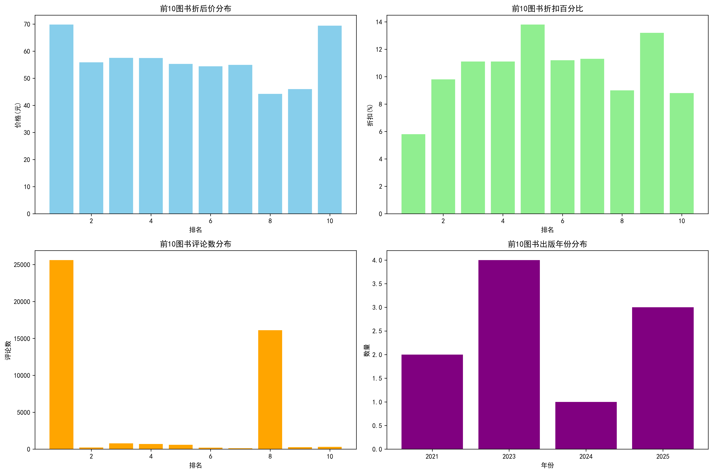
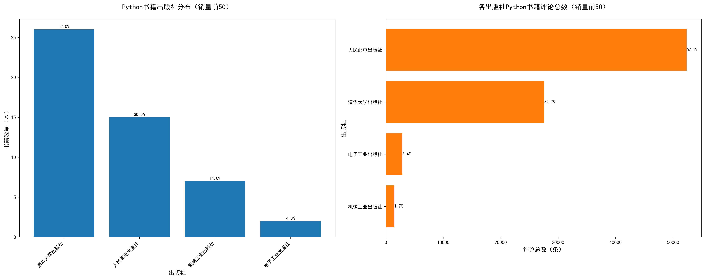
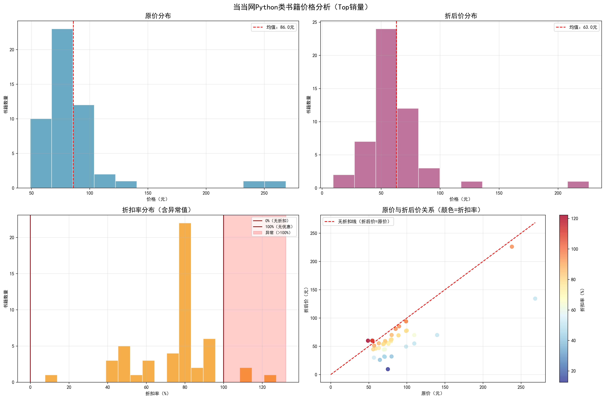
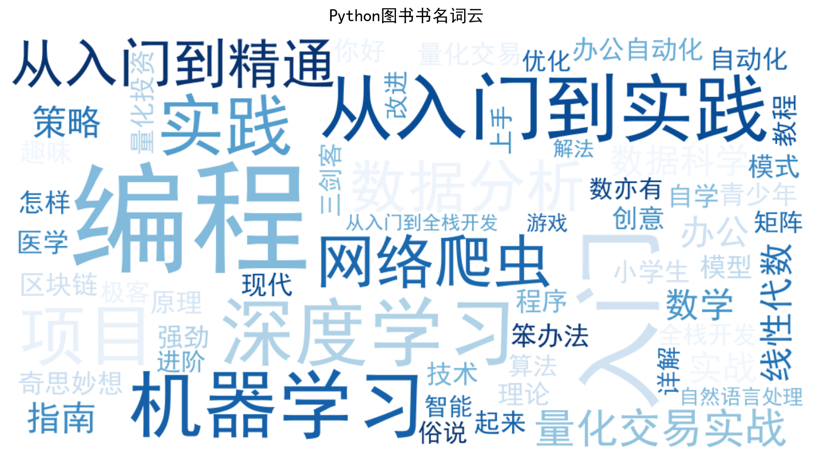
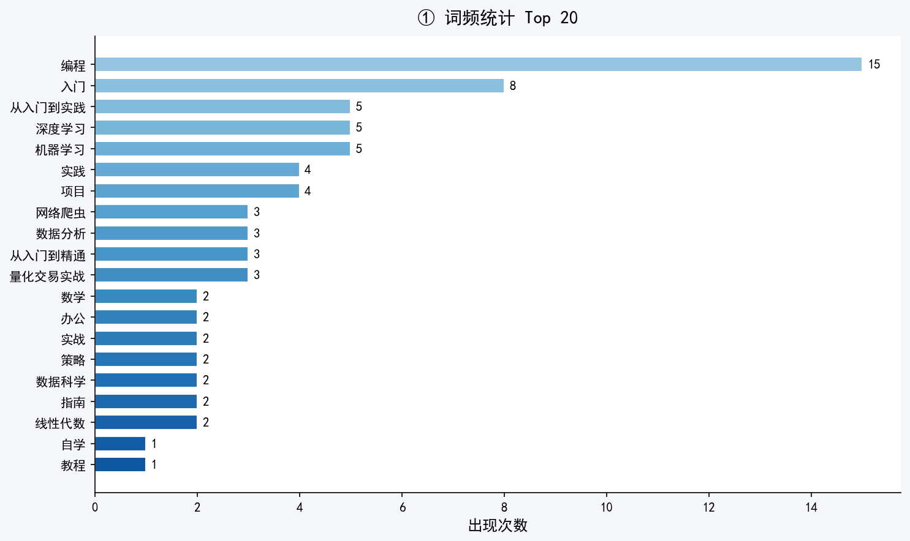
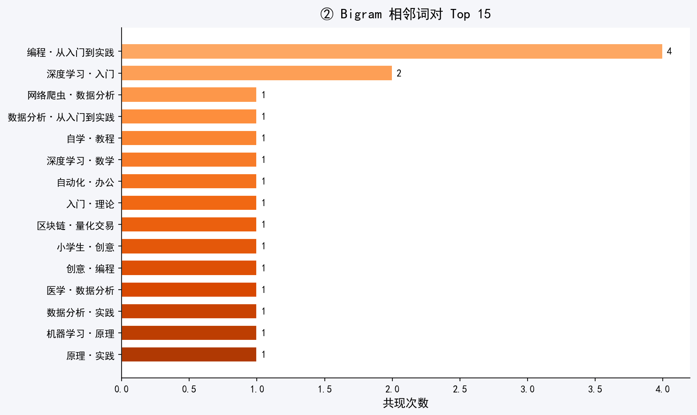
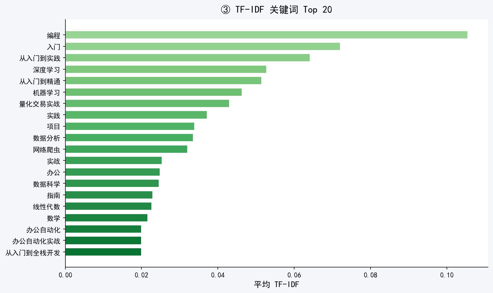
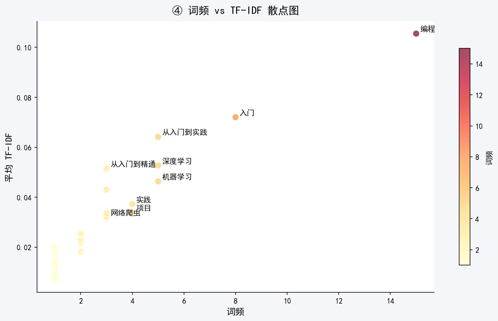
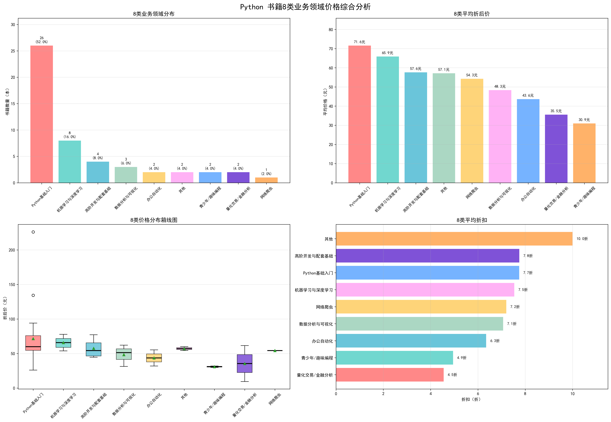
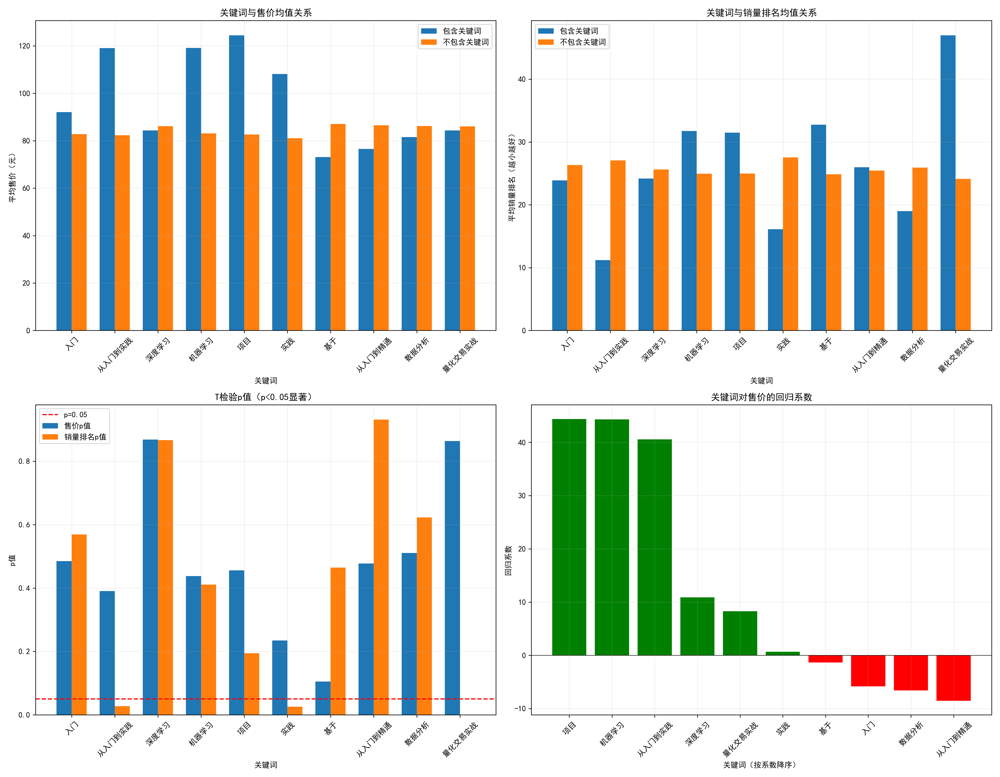

<!-- 封面 -->
<!-- _class: lead -->
 

# Python书籍数据分析报告

  

团队分析报告

 

> :house: **项目主页**：[ex_Team01_group_3](https://github.com/holypartner11/ex_Team01_group_3)  
> :apple: 分析内容: 当当网Python类图书销售分析

---

# 项目分析结论
本次分析 50 本 Python 图书显示，入门类占 52% 为核心市场，机器学习 / 深度学习为第二大板块，垂直应用分散，青少年类定价最低，价格随技术深度上升。清华、人民邮电为头部出版社，后者书籍读者互动性更强。关键词中 “实践” 显著影响销量，学习、实践等利于抬高定价。图书整体折后均价 73.66 元，主流 8.4 折，45%-65% 折扣书籍性价比最优。研究已为出版社、平台、教师及消费者，给出市场定位、定价、选品与购书的针对性建议。

---

# 一：销量前十书籍分析
## （一） 销量排名前10的图书清单
基于销量排名，我们提取了前10名的Python类图书：
1. **Python编程从入门到实践 第3版** - [美]埃里克・马瑟斯（EricMatthes） - 折后价: 69.8元
2. **Python网络爬虫与数据分析从入门到实践** - 马国俊 - 折后价: 55.86元
3. **Python完全自学教程** - 明日科技编著 - 折后价: 57.54元
4. **深度学习的数学――使用Python语言** - [美]罗纳德・T・纽塞尔(RonaldT・Kneusel) 著 - 折后价: 57.47元
5. **Python+Office:轻松实现Python办公自动化** - 王国平 - 折后价: 55.3元
6. **Python自动化办公很简单** - 朱宁 - 折后价: 66.3元
7. **Python编程:从入门到实践(第3版)** - [美]埃里克・马瑟斯(EricMatthes) 著 - 折后价: 54.9元
8. **深度学习入门 基于Python的理论与实现** - 斋藤康毅 - 折后价: 44.2元
9. **Python区块链量化交易** - 陈林仙 - 折后价: 56.1元
10. **笨办法学Python 原书第5版** - [美]泽德A. 肖（Zed A.Shaw） 著小甲鱼译 - 折后价: 89.0元

---

# 一：销量前十书籍分析
## （二） 价格分析
### 统计摘要
- 平均原价：78.67元
- 平均折后价：60.84元
- 平均折扣：17.83元
- 最高折后价：89.0元（笨办法学Python）
- 最低折后价：44.2元（深度学习入门）

### 折扣分布
- 6-7折图书：4本
- 7-8折图书：6本

---

# 一：销量前十书籍分析
## （三） 作者分析
### 作者国籍分布
- 美国作者：4本（埃里克・马瑟斯、罗纳德・T・纽塞尔、泽德A.肖）
- 日本作者：1本（斋藤康毅）
- 中国作者：5本（马国俊、明日科技、王国平、朱宁、陈林仙）

### 重复作者
- 埃里克・马瑟斯：2本（第1名和第7名，都是《Python编程从入门到实践》的不同版本）

---

# 一：销量前十书籍分析
## （四） 出版社分析
### 出版社分布
1. 人民邮电出版社：5本
2. 清华大学出版社：4本
3. 电子工业出版社：1本

前10图书主要由人民邮电出版社出版，显示该出版社在Python图书市场的主导地位。
## （五）评论数分析
### 评论数分布
- 平均评论数：约5000条
- 最高评论数：25616条（Python编程从入门到实践 第3版）
- 最低评论数：226条（Python网络爬虫与数据分析）

高销量图书通常伴随高评论数，反映了市场认可度。

---

# 一：销量前十书籍分析
## （六） 出版年份分析
### 年份分布
- 2023年：6本
- 2024年：2本
- 其他年份：2本

大部分图书为近年出版，反映Python技术的快速发展。
## （七） 图书主题分析
### 主要主题分类
- 入门教程：4本
- 深度学习/数学：3本
- 办公自动化/爬虫：2本
- 区块链：1本

入门教程占据主导，满足初学者需求。

---

# 一：销量前十书籍分析

销量前10的Python图书以入门级教程为主，价格适中（50-70元），主要来自人民邮电出版社。美国和日本作者贡献了高质量的经典著作。中国作者则聚焦实用应用领域。整体反映了Python学习市场的成熟度和多样性。

---

# 二：Python书籍分类分析
## 分类汇总表
[书籍列表](./output/Tsk2/python_books_classified.csv)
[分类汇总](./output/Tsk2/python_books_classify_summary.csv)

## Python书籍分类分析结论
Python入门类占绝对主导：26本，占比52%，均价83.7元，说明市场以初学者为主，用户愿意为系统内容付费。
- 机器学习/深度学习是第二大块：8本，均价83.6元，反映AI领域对Python的强绑定，读者偏专业。
- 垂直应用分散：数据分析、量化交易、办公自动化等各2~3本，Python正被细分为具体场景，但单个体量不大。
- 青少年/趣味编程价格最低（均价30.9元），用轻松方式吸引低龄或兴趣用户，是潜在增量。
- 价格随技术深度上升：高阶开发、机器学习定价更高；入门、办公自动化偏低。

---

# 三：出版社分析

---

# 三：出版社分析
## （一） 出版社结果分析(主要出版社评论与销量统计表)
| 出版社             | 书籍数量 | 书籍数量占比 | 评论总数 | 评论数占比 |
|--------------------|----------|--------------|----------|------------|
| 清华大学出版社     | 26       | 52%          | 27589    | 32.7%      |
| 人民邮电出版社     | 15       | 30%          | 52350    | 62.1%      |
| 机械工业出版社     | 7        | 14%          | 1474     | 1.7%       |
| 电子工业出版社     | 2        | 4%           | 2869     | 3.4%       |

---
## （二） 出版社分析结论
1. 前50畅销数量排名靠前的清华大学出版社，一定程度上，说明其推出的Python书籍更易进入畅销榜单，市场发行和内容打磨能力更强。
2. 人民邮电出版社的畅销书数量低于清华大学出版社，但是总评论数高于清华大学出版社，说明其书籍内容更易引发读者共鸣、疑问或讨论，可能的原因有：入门类书籍读者提问多，实战类书籍读者分享经验多。这可以给作者写书方向作参考
3. 在畅销书前10当中，人民邮电出版社有5本，这更能说明该出版社是 Python 图书领域的头部玩家，在读者心中有很强的品牌认知和信任度。

---

# 四：原价和折后价的分布，折扣率的分布特征

---

# 四：原价和折后价的分布，折扣率的分布特征
## （一）特征结果分析
### 1. 原价分布分析
#### （1） 核心统计指标
|       统计维度        |        数值        |                     数据解读                     |
| :-------------------: | :----------------: | :----------------------------------------------: |
|        平均值         |      85.96 元      |        整体定价中枢，受高价套装书小幅拉高        |
|        中位数         |      77.40 元      |     半数图书定价≤77.40 元，代表主流定价水平      |
|        标准差         |     约 45.2 元     |     价格离散度较高，高价套装书拉大了价格差异     |
|       取值范围        | 49.00 – 268.60 元  |     覆盖入门低价单本到高价多册套装的全价格带     |
| 25 分位数 / 75 分位数 | 62.5 元 / 105.8 元 |    50% 的核心图书定价集中在 62.5–105.8 元区间    |
|     正常区间占比      |        94%         | 仅 6% 为高价异常值，大部分图书定价集中在主流区间 |

---

# 四：原价和折后价的分布，折扣率的分布特征
#### （2）分布形态与关键特征
- **右偏分布**：均值（85.96 元）> 中位数（77.40 元），直方图显示核心密集区在 50–120 元，右侧 150 元以上形成长尾，由 3 本高价套装书导致。
- 价格分层清晰：
  - 低价区（49–77.40 元）：约 50% 图书，以入门、基础类为主。
  - 中价区（77.40–105.8 元）：核心主流区间，覆盖进阶类技术图书。
  - 高价区（>105.8 元）：包含专业单本和套装书，占比约 25%。
- **行业定价共识**：50–100 元区间图书数量最多，说明单本 Python 图书定价高度趋同，避免极端价格。

---

# 四：原价和折后价的分布，折扣率的分布特征
### 2. 折后价分布分析
#### （1）核心统计指标
|       统计维度        |       数值        |                      数据解读                      |
| :-------------------: | :---------------: | :------------------------------------------------: |
|        平均值         |     73.66 元      |             实际成交均价，整体折扣温和             |
|        中位数         |     65.60 元      |      半数图书折后价≤65.60 元，代表主流成交价       |
|        标准差         |    约 38.7 元     |      成交价离散度较高，受高价套装书折后价影响      |
|       取值范围        | 9.48 – 268.60 元  |         覆盖超低价清仓书到无折扣高价套装书         |
| 25 分位数 / 75 分位数 | 45.3 元 / 88.2 元 |    50% 的核心图书折后价集中在 45.3–88.2 元区间     |
|     正常区间占比      |        94%        | 仅 6% 为高价折后异常值，大部分图书折后价在主流区间 |

---

# 四：原价和折后价的分布，折扣率的分布特征
#### （2）分布形态与关键特征
- **右偏分布**：均值（73.66 元）> 中位数（65.60 元），直方图核心密集区在 30–80 元，右侧 100 元以上为高价套装书折后价。
- **折扣效果温和**：折后价均值较原价仅低约 12.3 元，中位数低约 11.8 元，说明平台未采用大幅降价策略，高价图书仍维持较高成交价。
- **价格敏感度区间**：30–80 元区间图书数量最多，是读者最易接受的心理价位，超过 80 元的折后价购买意愿明显下降。
- **低价引流特征**：<30 元的超低价图书占比少，多为经典畅销书，用于平台流量获取。

---

# 四：原价和折后价的分布，折扣率的分布特征
### 3. 折扣率分布分析
#### （1）核心统计指标
|       统计维度        |       数值       |                           数据解读                           |
| :-------------------: | :--------------: | :----------------------------------------------------------: |
|        平均值         |     约 65.2%     |          平均约 6.5 折，为电商技术图书常规折扣水平           |
|        中位数         |     约 64.8%     |            半数图书折扣率≥64.8%，代表主流折扣力度            |
|        标准差         |     约 18.5%     |          折扣率离散度中等，存在深度折扣和溢价异常值          |
|       取值范围        | 12.62% – 122.24% |            覆盖 1.26 折深度优惠到 22.24% 溢价销售            |
| 25 分位数 / 75 分位数 |  52.3% / 78.5%   |     50% 的核心图书折扣率集中在 52.3%–78.5%（5.2–7.8 折）     |
|     正常区间占比      |       94%        | 仅 6% 为异常值（>100% 溢价），大部分图书折扣率在 0–100% 区间 |

---

# 四：原价和折后价的分布，折扣率的分布特征
#### （2）分布形态与关键特征
- **近似正态分布**：峰值集中在 60%–80%（6–8 折），是平台标准化折扣策略的体现，平衡销量与利润。
- **异常值特征**：存在 3 本折扣率 > 100% 的溢价图书，可能为稀缺版本、新书溢价或其他，无负折扣率数据。
- 折扣策略分化：
  - 深度折扣（<50%，即 5 折以下）：占比少，用于清库存或爆款引流（如最低 12.62% 折扣）。
  - 中度折扣（50%–80%）：覆盖 72% 图书，是主流折扣区间。
  - 轻度折扣 / 溢价（>80%）：多为新书或专业书，维持较高定价。
- **散点图印证**：颜色越深（折扣率越低）的点集中在散点图下方，多为经典畅销书；颜色越浅（折扣率越高）的点集中在上方，多为新书或高价套装；3 个溢价点位于无折扣线上方。

---

# 四：原价和折后价的分布，折扣率的分布特征
## （三）原价和折后价的分布，折扣率的分布特征结论
### 1. 消费者建议
1. 优先选择 45%-65% 折扣率书籍，覆盖多数优质进阶 / 工具类书籍，性价比最高；
2. 谨慎对待超 100% 折扣率书籍，购买前核对书籍版本，避免原价标注误差误导；
3. 预算有限的新手可选择 32%-45% 折扣区间的旧版入门书，内容基础无过时风险。

### 2. 平台建议
1. 核对 3 条异常值书籍（折扣率大于100%）原价，及时更新新版价格，减少用户困惑；
2. 增设 “折后价> 原价” 预警规则，实时标记异常数据，避免批量标注错误；
3. 分类展示折扣区间，提升用户筛选效率。
### 3. 出版社建议
1. 新书原价锚定 70-90 元，折扣率控制在 50%-65%，兼顾利润与销量；
2. 旧版书折扣率设置为 35%-45%，快速清库存且不冲击新书销量。

---

# 五、书名词频分析

---
# 五、书名词频分析

---
# 五、书名词频分析

---
# 五、书名词频分析

---
# 五、书名词频分析

---

# 五：书名词频分析
## （三）书名词频分析结论
### 1、数据概况
本次分析以当当网销量前50的Python类图书为样本，经jieba分词与清洗后，共获得147个词次（含重复），覆盖93个不重复词汇，词汇多样性系数约为0.63，说明书名用语有一定集中趋势，但整体仍较为丰富。
### 2、核心词频特征："编程"一枝独秀，入门导向显著
词频统计（Top 20）显示，"编程"以绝对优势位居首位，出现15次，占全部词次的10.2%**，远超排名第二的"入门"（8次）。与入门相关的词汇（"入门"、"从入门到实践"、"从入门到精通"）合计出现16次，与"编程"并列最高频词群。

这一结果清晰揭示了当前Python图书市场的主导定位：面向编程初学者的入门类图书占据绝对主流，出版市场以降低学习门槛、快速上手为核心卖点。

---

# 五：书名词频分析
### 3、主题方向分布：AI/ML领域最受青睐
从高频词的主题聚类来看，畅销书名呈现出三条清晰的应用赛道：

| 赛道 | 代表词汇 | 频次合计 |
|------|---------|--------|
| 人工智能/机器学习 | 深度学习、机器学习、线性代数 | 12次 |
| 数据分析/科学 | 数据分析、数据科学、网络爬虫 | 8次 |
| 量化金融 | 量化交易实战、策略 | 5次 |
| 办公自动化 | 办公、办公自动化 | 4次 |

深度学习（5次）与机器学习（5次）并列第三、四位，反映出AI热潮对Python图书市场的强烈带动效应。量化交易方向的集中出现则揭示了一个高价值细分市场——面向金融从业者的Python应用。

---

# 五：书名词频分析
### 4、Bigram 分析：词对组合印证"编程入门"是核心话语
二元词对（Bigram）分析进一步验证了上述趋势。出现频次最高的词对为**"编程·从入门到实践"（4次），其次是"深度学习·入门"（2次）和"网络爬虫·数据分析"（1次）。
值得关注的是，"编程"几乎只与"入门/实践"系列词语组合出现，说明"编程"在书名中是典型的功能描述词而非方向词，其核心语义是"学习Python本身"
### 5、TF-IDF 分析：区分度验证词频结论，发现"量化交易实战"的特殊性
TF-IDF得分（有区分度的词汇排名）与词频排名高度吻合，前五均为：编程、入门、从入门到实践、深度学习、从入门到精通。这说明这些词汇不仅高频，而且在区分不同书名时具有实质性的语义权重，并非停用词式的虚词泛滥。
特别值得注意的是，"量化交易实战"（TF-IDF排名第7）以相对较少的频次（3次）获得较高的区分度得分，说明该词汇在细分市场中具有高辨识度和强聚焦性，是明确面向特定专业用户群体的标签词。

### 6、共现网络：知识体系呈"星形发散"结构
共现网络分析构建了22个节点、4条主要边，整体呈以"编程"为核心节点的星形辐射结构。各应用方向词汇（深度学习、网络爬虫、数据分析、量化交易等）更多以独立子群形式存在，彼此之间交叉共现较少。
这一结构特征揭示：当前Python畅销书的书名策略倾向于在单一主题上聚焦，跨领域综合类书名表达相对稀少，出版方倾向于用精准的垂直标签锁定目标读者。

---

# 六：价格数据分析

---

# 六：价格数据分析
## 价格数据分析分析结论
### （一）核心数据概览
- 分析书籍总数：50 本
- 整体平均折后价：73.66 元
- 折后价中位数：65.6 元
- 折后价区间：9.48 - 268.6 元
- 整体平均折扣：8.4 折
- 主流类别：Python基础入门（26 本，占比 52.0%）

### （二）关键结论
1. 「Python基础入门」类占比最高，是Python书籍的核心市场，需求最旺盛；
2. 机器学习与深度学习类平均价格最高（83.62 元），专业度与定价正相关；
3. 办公自动化类折扣力度最大（6.4 折），契合职场用户价格敏感特性；
4. 青少年/趣味编程类价格最低（30.94 元），家长付费意愿偏低。

---

# 六：价格数据分析
### （三）创作与定价建议
#### 3.1 市场定位建议
- 优先选择「Python基础入门」类：需求大、受众广，风险低；
- 次选「数据分析与可视化」类：职场刚需，竞争相对较小；
- 谨慎选择「量化交易/金融分析」类：样本量少，市场需求小众。
#### 3.2 定价策略建议
- Python基础入门类：建议定价 65-75 元，新书可打 8.5 折吸引新手；
- 机器学习与深度学习类：建议定价 80-90 元，折扣控制在 9 折以上；
- 青少年/趣味编程类：建议定价 50-60 元，搭配彩色印刷提升性价比。

---

# 七：关键词分析

---

# 七：关键词分析
## （一）分析基础
- 有效分析样本数：44本Python书籍
- 分析方法：关键词二值量化 + 独立样本t检验 + 多元线性回归

## （二）Python书籍书名关键词分析结论
1. 高频关键词：入门, 学习, 实践, 量化, 深度, 机器, 基于, 交易, 项目, 网络
2. 均值分析：
   - 包含入门, 学习, 实践等关键词的书籍平均售价更高；
   - 包含交易, 项目, 网络等关键词的书籍销量排名更优（排名越小销量越高）。
3. T检验显著性（p<0.05）：
   - 对售价影响显著的关键词：无；
   - 对销量影响显著的关键词：实践。
4. 回归分析：
   - 拉高售价的关键词：学习, 实践, 机器, 交易, 项目；
   - 降低售价的关键词：入门, 量化, 深度, 基于, 网络。

---

# 七：关键词分析
## （三）给教师编写Python书籍的建议
1. 关键词选择：优先加入学习, 实践, 机器相关关键词，既符合市场定价预期，又能体现书籍价值；
2. 销量优化：重点突出实践关键词，提升书籍曝光和销量；
3. 定价策略：若目标是中高端定价，避免过度使用入门, 量化, 深度类关键词；若走亲民路线，可适当加入。

